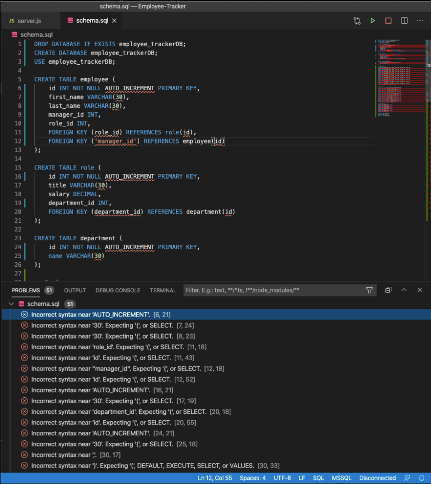

# Employee-Tracker

## Description 

Employee Tracker is a command-line application to be used to organzie company departments and employees in a database. The user is able to add, edit and delete departments, roles and employees using the CLI.

## Table of Contents

* [Usage](#usage)
* [Technology](#technology)
* [Problems](#problems)
* [Questions](#questions)

## Usage 

In order to be able to use Employee-Tracker, the user must first navigate to the CLI and run 'npm install'. Once the depencies are installed, run server.js in the command-line and the prompts will begin to help you organize departments, roles and employees. 

The initial prompt will ask whether you would like to add or edit a department, role or employee. Based on your answer you will be directed to interact directly with the database. Your responses will be saved to the DB and can be viewed by going back to the main menu. 

## Technology
Github - Hosts repo and used to deploy the public URL
Node.js - Package management and to execute JavaScript code to buld CLI tools
Express.js - Middleware to connect the frontend and backend
MySQL - The relational database used to store company, role and company data. 

## Problems
I spent some time with our TAs to try and understand why my schema was not working properly. I used the same format that was in our module and for whatever reason it was throwing off multiple problems. Screenshot below;

## Questions?
  
 
  
For any questions, please contact me with the information below:
 
GitHub: [@awarmath](https://api.github.com/users/awarmath)
Email: andrewwarmath@gmail.com